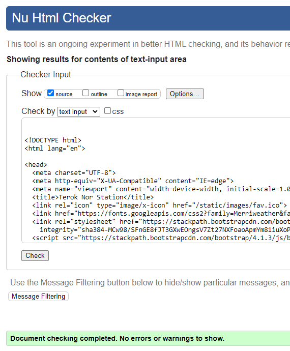
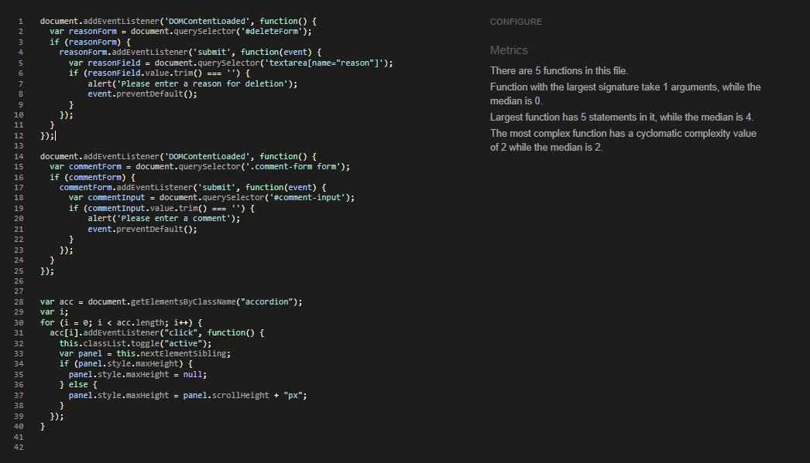

# Terok Nor Station

# Goal for this Project
My overall goal for my project is to create a fan website for Star Trek Deep Space Nine, where the user of the website can contribute to the development of the website by contributing data about the show. The user will be able to create an account so that they will be able to add, edit and delete information about the site and also be able to interact with other users of the website in the community section. The community section will be an open forum where user can discuss their enjoyment of the show and also give updates, and input on the development of the website. The project will also have a admin-section where the admin can approve or reject request from user to add, edit or delete information from the website.

# Table of Contents
* [UX](#ux "UX")
    * [User Goals](#user-goals "User Goals")
    * [User Stories](#user-stories "User Stories")
    * [User Requirements and Expectations](#user-requirements-and-expectations)
         * [Requirements](#requirements)
         * [Expectations](#expectations)
    * [Site Owners Goals](#site-owners-goals)
    * [Strategy](#strategy)
        * [Strategy Outline](#strategy-outline)
        * [Strategy Description](#strategy-description)
    * [Wireframes](#wireframes)
    * [Design Choices](#design-choices)
        * [Fonts](#fonts)
        * [Colours](#colours)
        * [Images](#images)
        * [Structure](#structure)
    * [Features](#features)
        * [Existing Features](#existing-features)
        * [Features to be implemented](#features-to-be-implemented)
    * [Technologies used](#technologies-used)
        * [Languages](#languages)
        * [Libraries and Frameworks](#libraries-and-frameworks)
        * [Tools](#tools)
    * [Testing](#testing)
        * [UX Testing](#ux-testing)
        * [Code Validation](#code-validation)
        * [Bugs](#bugs)
        * [Unfixed Bugs](#unfixed-bugs)
    * [Deployment](#deployment)
        * [Clone the Repo](#clone-the-repo-with-gitpod)
        * [Set up your Workspace](#set-up-your-workspace)
        * [Deployment via Heroku](#deployment-via-heroku)
    * [Credits](#credits)
# UX
A user of Terok Nor station could generally be a fan of Star Trek of all ages. It may be someone who wants to look up information about Deep Space Nine or someone who likes to gather information and create entries to the databases.

## User Stories

### Epic | Website Function

* As a Site User I can use a navigation bar so that I can transverse to a different section of the website.
* As a Site User I can have the ability to log out of my account so that I am not currently always sign in.
* As a Site User I can create an account so that I can participate in the development of the fan database.
* As a Site User I can access the links to social media of the website so that I can stay updated on the going on of the website.
* As a User I can have access to a search bar so that I can quickly find the information that I am looking for.

### Epic | Community

* As a Site Admin I can pin posts to the top of the order of posts so that other users can see a post of important.
* As a Site User I can like or unlike a post in the community section so that I can favorite content that I like.
* As a User I can delete a comment in a post so that it doesn't exist anymore and can't be viewed.
* As a Site User I can delete my post in the community section so that I can have that access to not show the post
* As a Site User I can comment on posts in the community section so that I can discuss with other members of the community and also give information on the development of the database.
* As a Star Trek DS9 I can interact with other fans of the show so that that we can discuss the show.
* As a Site Admin I can pin posts to the top of the order of posts so that other users can see a post of important

### Epic | Season

* As a User I can select a specific season of the show so that I can view the data of that season

### Epic | Episodes

* As a Star Trek DS9 fan I can find information on specific episodes so that I can improve my knowledge of the show.
* As a Site User I can be able to add information about my Star Trek DS9 so that so that I can share my knowledge and insights with other fans.
* As a Site User I can be able to edit information about Star Trek DS9 so that so that I can make sure mistakes can be changed and that the information is correct for other users.
* As a Site User I can be able to delete information about episodes from the database so that I can replace incorrect information or irrelevant information.

### Epic | Site Admin

* As a Site Admin I can approve of information that is being sent to the database so that the information is correct and relevant to Star Trek DS9.
* As an Admin I can assign permission to users so that they can become moderator, that will be grant special permissions.
* As an admin I can approve or reject requests for edits of episodes so that I can confirm if the edit is correct
* As a Admin I can approve or reject so that I can control what is being deleted from the database

## User Requirements and Expectations

### Requirements

* Responsive Design for all screen sizes
* A structured layout to easily view the website 
* CRUD functionality for the community section and database section
* User registration

### Expectations

* I expect to be able to sign in and sign out of my account.
* I expect to be able to add, edit and delete my post in the community section.
* I expect to be able to make add, edit and delete request in the season page.
* I expect as a site admin to handle the request to the database.
* I expect to be able to comment on post in the community section.
* I expect to be able to delete comment on a post.

# Wireframes

I have used Balsamic to develop my wireframes for my website. I initially created the mobile version and then the wireframes and then scalled it up for both tablet and desktop. I only created layout's for page that would require alot of content and would change amongst the different screen sizes. I decide not to include the admin-request page and the approve and reject page as they will stay the same on all page sizes

The wireframes are below:

### [Mobile Wireframe](readmedoc/wireframe/teroknorstationmobile.bmpr)

### [Tablet Wireframe](readmedoc/wireframe/teroknorstationtablet.bmpr)

### [Desktop Wireframe](readmedoc/wireframe/teroknorstationdesktop.bmpr)

\
&nbsp;
[Back to Top](#table-of-contents)
\
&nbsp;

## Design Choices
### Fonts

The font I have chosen are both from [Google Fonts](https://fonts.google.com/)

The first font is [Sono](https://fonts.google.com/specimen/Sono) which will be the main font that will be seen throughout the website. It will be implemented on all font contnet. Reason from for picking this font is that it is clearly distinguishable from the header font that is very plain and simple as appose to Sono being a very striking font.

The second font is [Merriweather](https://fonts.google.com/specimen/Merriweather) which will be used on all header on the website. Reason for picking the font is mainly due to it plain and simplicity outlook when shown.

### Colours

For choosing my Colors for the website I used [ColorHexa](https://www.colorhexa.com/) and used to [Muzli Colors](https://colors.muz.li/) to create a pallet of the colors.

The colors I choose

| Hex Value | Root variable name | Text | Button | Background | Opposite Colour
| -- | -- | -- | -- | -- | --
| #FF7A7A | red | X |  X  | | black,
| #00f600 | green |  | X | | black
| #f8f8ff | white | X | X| | black,
| #d3d3d3 | grey |  |  |   X | black ,
| #141414 | black | x |  |  X | grey, white, red, green, 

All of the desired colour combinations have passed the [WebAIM Contrast Checker](https://webaim.org/resources/contrastchecker/ "WebAIM") and the results can be seen below.

| Colour 1 | Colour 2 | Results
| -- | -- | --
| red | black | [result](readmedoc/colortest/red-black-test.png)
| green | black | [result](readmedoc/colortest/green-black-test.png)
| white | black | [result](readmedoc/colortest/white-black-test.png)
| grey | black | [result](readmedoc/colortest/black-grey-test.png)

### Images

I have included some images that will render from local files.

* The background image of space that is render on all pages behind the container

* The welcome image on the index page

* The debug image that will render if images from cloudniary can't be access

* The error page image

* The favicon

## Structure

### Modal Diagram

Diagram for the fan_database app

Diagram for the community app

### Models Info

Season Modal

| Name | Key | Type | Other Details
| -- | -- | -- | --
| season_number | | IntegerField
| start_date | | dateField
| end_date | | dateField
| episode_count | | IntergerField
| image | | CloudinaryField | "image", default='debug-image.jpg'
| summary | | Textfield | default='Enter an summary on what happen in the season'

Episode Modal

| Name | Key | Type | Other Details
| -- | -- | -- | --
| overall_episode_number | | IntegerField | 
| season_episode_number | | IntegerField |
| season | FK(Season) | | on_delete=models.CASCADE
| title | | CharField | max_length=220 | 
| image | | CloudinaryField | "image", default="debug-image.jpg", blank=True |
| synopsis | | TextField | default="Enter synopsis for episode, keep it brief and in one paragraph" |
| plot | | TextField | default="Write a detail description of the episode's plot, use multiple paragraphs" |
| air_date | | DateField | 
| stardate | | DecimalField | max_digits=6, decimal_places=1 |
| updated | | DateTimeField | auto_now=True |
|created | | DateTimeField | auto_now_add=True |
|approved | | BooleanField | default=False |

EpisodeLog Modal

| Name | Key | Type | Other Details
| -- | -- | -- | --
| episode | FK(Episode) | | on_delete=models.CASCADE
| user | FK(User) | | on_delete=models.SET_NULL, null=True
| timestamp | | DateTimeField | auto_now_add=True
| overall_episode_number | | IntegerField
| season_episode_number | | IntegerField
| season | FK(Season) | | on_delete=models.SET_NULL
| title | | CharField | max_length=220
| synopsis | | TextField | 
| plot | | TextField | default="Write a detail description of the episode's plot, use multiple paragraphs"
| air_date | | DateField |
| stardate | | DecimalField | max_digits=6, decimal_places=1
| approved | | BooleanField | default=False

ApprovalRequest Modal

| Name | Key | Type | Other Details
| -- | -- | -- | --
| user | FK(User) | | on_delete=models.CASCADE
| object_to_approve | FK(Episode) |  | on_delete=models.SET_NULL
| approved | | BooleanField | default=False
| reason | | TextField | default="Enter inforamtion on the request"
| request_type | | CharField | max_length=10, choices=REQUEST_TYPES, Request_types = "approval", "edit", "delete" |

CommunitySection model

| Name | Key | Type | Other Details
| -- | -- | -- | --
| section | | CharField | max_length=200

Post Modal

| Name | Key | Type | Other Details
| -- | -- | -- | --
| created_by | FK(User) | | on_delete=models.SET_NULL, null=True
| section | FK(CommunitySection) | | on_delete=models.SET_NULL, null=True
| name | | CharField | max_length=200
| description | | TextField | null=True, blank=False
| created | | DateTimeField | auto_now=True
| updated | | DateTimeField | auto_now_add=True
| pinned | | BooleanField | default=False
| likes | | ManyToManyField | User, blank=True, related_name='post_likes'
| dislikes | | ManyToManyField | User, blank=True, related_name='post_dislikes'

Comment Modal

| Name | Key | Type | Other Details
| -- | -- | -- | --
| user | FK(User) | | on_delete=models.SET_NULL, null=True
| post | FK(Post) | | on_delete=models.SET_NULL, null=True
| body | | TextField |
| updated | | DateTimeField | auto_now=True
| created | | DateTimeField | auto_now_add=True

## App Flow

### Non Register-User

### Authenticated-User

### Admin

\
&nbsp;
[Back to Top](#table-of-contents)
\
&nbsp;

# Features

## Existing Features

&nbsp;

## Features to be Implemented

\
&nbsp;
[Back to Top](#table-of-contents)
\
&nbsp;

# Technologies used

## Languages

## Libraries and Frameworks

## Tools

# Testing

&nbsp;

| Age | Tech Experience | Task Completed | Comments/ Improvements
| --- | ----------      | -------------  | --------

&nbsp;

### UX Testing

| Requirements & Expectations | Implemented | Tested | Comments
| ------------ | ----------- | ------ | --------

&nbsp;

&nbsp;

| User Goals | Implemented | Tested | Comments
| ------------ | ----------- | ------ | --------

&nbsp;

&nbsp;

| Site Owners Goals | Implemented | Tested | Comments
| ------------ | ----------- | ------ | --------

\
&nbsp;
[Back to Top](#table-of-contents)
\
&nbsp;

## Code Validation

### HTML

I have used the [HTML W3C Validator](https://validator.w3.org) to validate all of my HTML files.

As my project uses Jinja syntax, such as ``, ``, and `{{ variable|filter }}`
it will not validate properly if I copy and paste into the HTML validator straight from my source files.

In order to properly validate my HTML pages with Jinja syntax for authenticated pages, I followed these steps:

- Navigate to the deployed pages which require authentication
- Right-click anywhere on the page, and select **View Page Source**.
- This will display the entire "compiled" code, without any Jinja syntax.
- Copy everything, and use the [validate by input](https://validator.w3.org/#validate_by_input) method.
- Repeat this process for every page that requires a user to be logged-in/authenticated.

| Page | Screenshot | Notes |
| --- | --- | --- |
| Home |  | Pass: No Errors
| Season |  | Pass: No Errors
| Community |  |Pass: No Errors
| search query |  |Pass: No Errors
| post |  | Pass: No Errors 
| post form |  | Fail: All summernote errors
| episode |  | Pass: No Errors
| episode form |  | Fail: All summernote errors
| delete |  | Pass: No Errors
| delete request |  | Pass: No Errors
| login |  | Pass: No Errors
| sign up |  | Fail: 4 errors 
| admin request |  | Pass: No Errors
| approve edit |  | Pass: No Errors
| approve add |  | Pass: No Errors
| approve delete |  | Pass: No Errors
| reject edit |  | Pass: No Errors
| reject add |  | Pass: No Errors
| reject delete |  | Pass: No Errors

### CSS

I have used the recommended [CSS Jigsaw Validator](https://jigsaw.w3.org/css-validator) to validate my CSS file.

| File | Screenshot | Notes |
| --- | --- | --- |
|style.css |  | Pass: No errors

### Javascript

I have used the recommended [JShint Validator](https://jshint.com) to validate all of my JS files.

| File | Screenshot | Notes |
| --- | --- | --- |
| script |  | Pass: No Errors

### Python

I have used the recommended [CI Python Linter](https://pep8ci.herokuapp.com) to validate all of my Python files.

| File | Screenshot | Notes |
| --- | --- | --- | --- |
| settings.py | [screenshot](readmedoc/pythonlinter/settings-linter.png) | Pass: No Errors
| urls.py (main) | [screenshot](readmedoc/pythonlinter/url-main-linter.png | Pass: No Errors)
| forms.py (fan_database) | [screenshot](readmedoc/pythonlinter/form-database-linter.png) | Pass: No Errors
| models.py (fan_database) | [screenshot](readmedoc/pythonlinter/modal-database-linter.png) | Pass: No Errors
| urls.py (fan_database) | [screenshot](readmedoc/pythonlinter/urls-database-linter.png) | Pass: No Errors
| views.py (fan_database) | [screenshot](readmedoc/pythonlinter/views-database-linter.png) | Pass: No Errors
| forms.py (community) | [screenshot](readmedoc/pythonlinter/forms-community-linter.png) | Pass: No Errors
| models.py (community) | [screenshot](readmedoc/pythonlinter/models-community-linter.png) | Pass: No Errors
| urls.py (community) | [screenshot](readmedoc/pythonlinter/urls-community-linter.png) | Pass: No Errors
| views.py (community) | [screenshot](readmedoc/pythonlinter/views-community-linter.png) | Pass: No Errors

## Lighthouse Audit

I've tested my deployed project using the Lighthouse Audit tool to check for any major issues.

| Page | Size | Screenshot | Notes |
| --- | --- | --- | --- |
| Home | Desktop |  | No major warnings |
| Home | Mobile |  | No major Warnings |
| Season | Destop |  | No Major Warning |
| Season | Mobile |  | No Major Warning |
| Episode | Desktop |  | No Major Warning |
| Episode | Mobile |  | No Major Warning |
| Episde Form | Desktop |  | Minor Warnings due to summernote |
| Episde Form | Mobile |  | Minor Warnings due to summernote |
| Delete Request | Desktop |  | No Major Warning |
| Delete Request | Mobile |  | No Major Warning |
| Community | Desktop |  | No Major Warning |
| Community | Mobile |  | No Major Warning |
| Post | Desktop |  | No Major Warning |
| Post | Mobile |  | Minor Warnings |
| Create Post | Desktop |  | Minor Warnings |
| Create Post | Mobile |  | Minor Warnings |
| Delete | Desktop |  | No Major Warning |
| Delete | Mobile |  | No Major Warning |
| Admin Request | Desktop |  | No Major Warning |
| Admin Request | Mobile |  | No Major Warning |
| Add Approve | Desktop |  | No Major Warning |
| Add Approve | Mobile |  | Minor Warnings |
| Edit Approve | Desktop |  | No Major Warninga |
| Edit Approve | Mobile |  | Minor Warnings |
| Delete Approve | Desktop |  | No Major Warnings |
| Delete Approve | Mobile |  | Minor Warnings |
| Add Reject | Desktop |  | No Major Warnings |
| Add Reject | Mobile |  | Minor Warnings |
| Edit Reject | Desktop |  | No Major Warnings | 
| Edit Reject | Mobile |  | Minor Warnings |
| Delete Reject | Desktop |  | No Major Warnings |
| Delete Reject | Mobile |  | Minor Warnings |
| Search | Desktop |  | No Major Warnings |
| Search | Mobile |  | No Major Warnings |
| Sign In | Desktop |  | No Major Warnings |
| Sign In | Mobile |  | No Major Warnings |
| Register | Desktop |  | No Major Warnings |
| Register | Mobile |  | No Major Warnings |

## Defensive Programming

Defensive programming was manually tested with the below user acceptance testing:

| Page | User Action | Expected Result | Pass/Fail | Comments |
| --- | --- | --- | --- | --- |
| **Home Page** | | | | |
| | Click on Logo in the navbar | Redirects to Home page | Pass | |
| | Click on Login link in the navbar | Redirects to Sign In Page | Pass | |
| | Click on logout link in navbar | Redirects to Sign In Page | Pass ||  
| | Click on sign up link in the community info | Redirects User to Register Page | Pass | |
| | Click on Home link in the navbar | Redirects to Home page | Pass | |
| | Click on a Season of the show link in the navbar | Redirects to the season of the show | Pass | |
| | Click on the community link in the navbar | Redirects to the community page | Pass |
| | Click the twitter icon in footer | Redirect to the twitter home page | Pass | |
| | Click the youtube icon in footer | Redirect to the youtube home page | Pass | |
| | Click the instagram icon in footer | Redirect to the instagram home page | Pass | |
| | Enter a valid search queary | Redirects to the search page with result | Pass |
| | Enter a nonvalid search queary | Redirects to the search page with no result found message | Pass |  |
| | As admin click on Admin request list | Redirects to the Admin request page | Pass |  |
| **Sign Up** | | | | |
| | Enter valid email address | Field will only accept email address format | Pass | |
| | Enter valid password (twice) | Field will only accept password format | Pass | |
| | Click already have an account link | Redirects to sign in page | Pass | |
| **Log In** | | | | |
| | Enter valid password | Field will only accept password format | Pass | |
| | Click Login button on login page | Redirects user to Home page | Pass | |
| | Click don't have a account link | Redirects to login page | Pass | |
| **Season Page** | | | | |
| | Click Next Season link in the infobox | Redirects user to the next season of the show | Pass | |
| | Click Add Episode Button | Redirects user to the episodes form page | Pass | |
| | Click Episode Title | Redirects the user to the episdoe page of that episode | Pass |
| | Click Edit Episode button | Redirects to the form of that episode | Pass | |
| | Click Delete Episode button | Redirects to the delete request page | Pass | |
| **Add Episode Page** | | | | |
| | Click Create Episode button with all fields inputted | Redirects to the Season that was filled out on the form | Pass | Messages of Your request to add an episode has been submitted. is placed underneath the Add Episode button
| | Click Create Episode button with all fields inputted except the Imagefield | Redirects to the Season that was filled out on the form | Messages of Your request to add an episode has been submitted. is placed underneath the Add Episode button
| | Click Create Episode button with Overall episode number not filled out | Message of please fill out field | Pass | |
| | Click Create Episode button with Season episode number not filled out | Message of please fill out field | Pass | |
| | Click Create Episode button with Season not selected | Message of please select item | Pass | |
| | Click Create Episode button with Title not filled out | Message of please fill out field | Pass | |
| | Click Create Episode button with Air date not filled out | Message of please fill out field | Pass | |
| | Click Create Episode button with Stardate not filled out | Message of please fill out field | Pass | |
| | Click Create Episode button with Reason not filled out | Message of please fill out field | Pass | |
| | Click Create Episode button with Plot not filled out | Message of please fill out field | Pass | |
| | Click Create Episode button with Plot filled with whitespace | Message of please fill out field | Pass | |
| | Click Create Episode button with Synopsis filled with whitespace | Message of please fill out field | Pass | |
| | Click Create Episode button with Synopsis filled not filled out | Message of please fill out field | Pass | |
| | Click the go back button | redirects the user back to where they click the create episode button | Pass | |
| **Update Episode Page** | | | | |
| | Click Create Episode with the reason field not filled out | Message of please fill out field | Pass | |
Click Create Episode button with all fields inputted | Redirects to the Season that was filled out on the form | Pass | Messages of Your request to edit an episode has been submitted. is placed underneath the Add Episode button
| | Click Create Episode button with all fields inputted except the Imagefield | Redirects to the Season that was filled out on the form | Messages of Your request to edit an episode has been submitted. is placed underneath the Add Episode button
| | Click Create Episode button with Overall episode number not filled out | Message of please fill out field | Pass | |
| | Click Create Episode button with Season episode number not filled out | Message of please fill out field | Pass | |
| | Click Create Episode button with Season not selected | Message of please select item | Pass | |
| | Click Create Episode button with Title not filled out | Message of please fill out field | Pass | |
| | Click Create Episode button with Air date not filled out | Message of please fill out field | Pass | |
| | Click Create Episode button with Stardate not filled out | Message of please fill out field | Pass | |
| | Click Create Episode button with Plot not filled out | Message of please fill out field | Pass | |
| | Click Create Episode button with Plot filled with whitespace | Message of please fill out field | Pass | |
| | Click Create Episode button with Synopsis filled with whitespace | Message of please fill out field | Pass | |
| | Click Create Episode button with Synopsis filled not filled out | Message of please fill out field | Pass | |
| | Click the go back button | redirects the user back to where they click the create episode button | Pass | |
| **Delete Episode Page** | | | | |
| | Click Yes send request with reason field filled out | Redirects to the Season that was filled out on the form | Pass | Messages of Your request to delete an episode has been submitted. is placed underneath the Add Episode button | |
| | Click Yes send request with reason field not filled out or with white space | message displayed Please enter a reason for deletion | Pass | | 
| | Click the go back button | Redirects to the season page where the Delete episode button was clicked | Pass | |
| **Community Page** | | | | |
| | Click the Show Discusion link | All post that have the show discussion section tags will be displayed only | Pass | | 
| | Click the All link | All post will be displayed | Pass | | 
| | Click the Site Development link | All post that have the site development section tag will be displayed only | Pass | |
| | Click the Create Post button | Redirect to the create post page | Pass | |
| | Click the Edit Post button of a post | Redirects to that post's data | Pass | 
| | Click the Delete Post button of a post | Redirects to the delete page | Pass | 
| | Click the Post title link | Redirect to the post page | Pass | |
| | As user with delete perms click the delete post button | Redirects to the delete page | Pass | |
| **Post Page** | | | | |
| | Click the like button | Like button turns green and the number counter adds 1 | Pass | |
| | Click the dislike button | Dislike button turn red and the number counter adds 1 | Pass | |
| | Click the like button when the dislike button has been clicked before | Like button turns Green number counter adds 1 and the dislike button turns grey and the number counter subtract one | Pass |  |
| | Click the dislike button when the like button has been clicked before | dislike button turns red number counter adds 1 and the like button turns grey and the number counter subtract one | Pass |  
| | Click the submit button when there is no input in the textfield | An alert message is displayed with the comment PLease enter a comment | Pass |  | 
| | Click the submit button when there is whitespace in the text field | An alert message is displayed with the comment PLease enter a comment | Pass |
| | Click the submit button when there is text in the text field | The comment should render in beneath the textfield | Pass | |
| | Click the delete comment button on a comment in the comments | Redirect to the delete page | Pass | |
| **Delete Comment Page** | | | | |
| | Click the confirm button | redirect to the post and the comment is deleted | Pass | |
| | Click the go back button | redirect to the post | Pass |  |
| **Edit Post Page** | | | | |
| | Click the create Post button when no data has been changed | Validation error message will show displaying You haven't made any changes to the post | Pass |  |
| | Click the create post button when data has changed | Redirect to the community page and the changes have been saved | Pass | |
| | Click the go back button | Redirect to the community page | Pass | |
| **Create Post Page** | | | | |
| | Click the create post button with data entered | Redirects to the community page with the post saving | Pass | |
| | Click the create button with section not picked | Alert to pick a item in the section | Pass | |
| | Click the create button with Name not entered or whitespace enter| Alert to enter a name in the field | Pass | |
| | Click the create button with description not entered or whitespace enter | Alert to user this field is required | Pass | |
| | Click the create button with the pinned button selected | Post will be pinned to the top of post | Pass | |
| | Click the go back button | redirect the user back to the community page | Pass | |
| **Admin Page** | | | | |
| | Click on the approve delete request button | redirect to the approve delete request page | Pass |  |
| | Click on the approve add request button | redirect to the approve add request page | Pass |  |
| | Click on the approve edit request button | redirect to the approve edit request page | Pass |  |
| | Click on the reject edit request button | redirect to the reject edit request page | Pass |  |
| | Click on the reject add request button | redirect to the reject add request page | Pass |  |
| | Click on the reject delete request button | redirect to the reject delete request page | Pass |  |
| **Approve Delete request page** | | | | |
| | Click on Yes Approve button | Redirect to the admin-request page and delete the episode | Pass |  |
| | Click on the No, go back button | Redirect to the admin-request page | Pass |  | 
| **Reject Delete request page** | | | | |
| | Click on Yes reject button | Redirect to the admin-request page and keeps the episode | Pass |  |
| | Click on the No, go back button | Redirect to the admin-request page | Pass |  | 
| **Approve add request page** | | | | |
| | Click on Yes Approve button | Redirect to the admin-request page and add the episode | Pass |  |
| | Click on the No, go back button | Redirect to the admin-request page | Pass |  | 
| **Reject add request page** | | | | |
| | Click on Yes reject button | Redirect to the admin-request page and delete the episode that was submitted | Pass |  |
| | Click on the No, go back button | Redirect to the admin-request page | Pass |  | 
| **Approve edit request page** | | | | |
| | Click on Yes Approve button | Redirect to the admin-request page and add the edited episode | Pass |  |
| | Click on the No, go back button | Redirect to the admin-request page | Pass |  | 
| **Reject edit request page** | | | | |
| | Click on Yes reject button | Redirect to the admin-request page and delete the edited episode| Pass |  |
| | Click on the No, go back button | Redirect to the admin-request page | Pass |  | 
&nbsp; 

## Bugs

## Unfixed Bugs

\
&nbsp;
[Back to Top](#table-of-contents)
\
&nbsp;

# Deployment

<!-- ADD LIVE LINK HERE -->

 
### Clone the repo with GitPod
* Log in to your GitHub account
* Follow this link to access this repository - ******* ENTER LINK HERE *******
* Select the **Code** dropdown button situated above the list of files
* Make sure that the HTTPS tab is selected
* Click on the **Copy** button to the right of the URL
* Open a new GitPod workspace
* In the terminal type *git clone (paste the URL here)* and then press enter
* The repo will now be downloaded and cloned
* Open your [GitPod workspaces](https://gitpod.io/workspaces "GitPod workspaces")
* Select the three dots to the right-hand side of your workspace and select **Pin**

<!-- Add as required -->
<!--
### Set up your Workspace

### Deployment via Heroku

* Visit [heroku.com](https://www.heroku.com/home "Heroku")
* Create a new account or sign in
* From the dashboard, select **New** and then **Create new app**
* Enter an individual app name into the text box, select a region from the dropdown and then press **Create app**
* A Heroku app has now been created and the **Deploy** tab is opened. 
* Select the **Settings** tab
* Click on the **Reveal Config Vars** button
-->

<!-- ADD OR ADJUST CONFIGS -->
<!--
* In the textbox with KEY as the placeholder, enter *CREDS*
* In the textbox with VALUE as the placeholder, enter the content from the creds.json file and press **Add**
* In the textbox with KEY as the placeholder, enter *PORT*
* In the textbox with VALUE as the placeholder, enter *8000*
* press **Add**
* In the buildpacks section of the settings tab, click on **Add Buildpack**, select **python** and then save changes
* Click on **Add Buildpack** again, select **node.js** and then save changes
* When they are on the dashboard, ensure that python is above node.js on the list
-->

<!-- END OF CONFIGS -->
<!--
* Open the **Deploy** tab
* In the deployment method section, select **GitHub** and confirm the connection.
* Enter the repo-name into the text box and click **Search**. When the correct repo appears below, click **Connect**
* In the Automatic deploys section, click **Enable Automatic Deploys**. This updates every time GitHub code is pushed
* To complete the process click on the **Deploy Brach** button in the Manual deploy section, this will take a few seconds to complete while Heroku builds the app
* A message will appear informing you that the app was successfully deployed and a **View** button will bring you to the live site
-->

\
&nbsp;
[Back to Top](#table-of-contents)
\
&nbsp;

# Credits

\
&nbsp;
[Back to Top](#table-of-contents)
\
&nbsp;