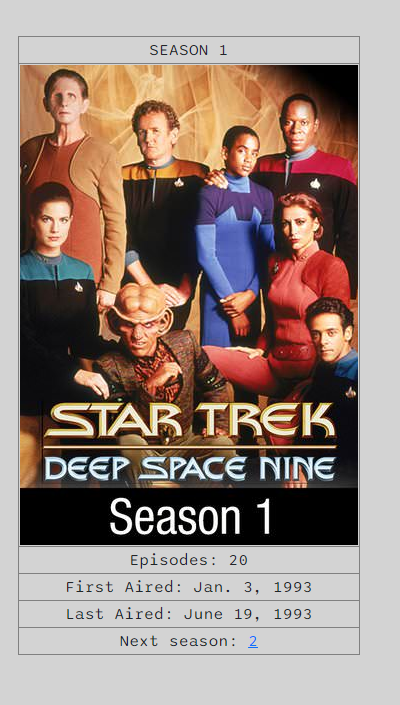
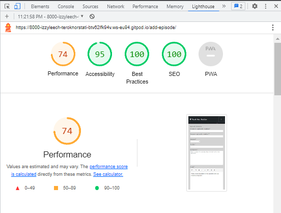
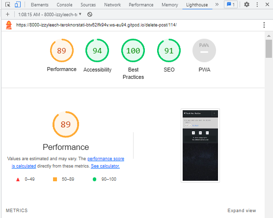
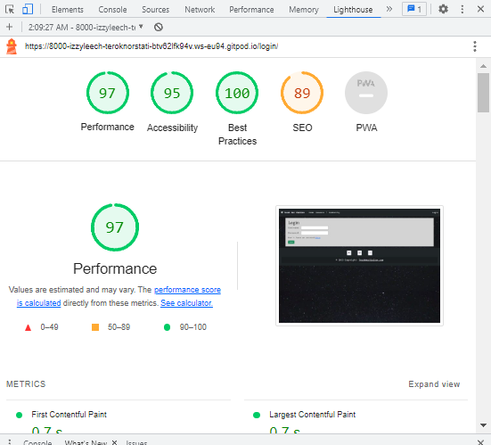

# Terok Nor Station

# Goal for this Project
My overall goal for my project is to create a fan website for Star Trek Deep Space Nine, where the user of the website can contribute to the development of the website by contributing data about the show. The user will be able to create an account so that they will be able to add, edit and delete information about the site and also be able to interact with other users of the website in the community section. The community section will be an open forum where user can discuss their enjoyment of the show and also give updates, and input on the development of the website. The project will also have a admin-section where the admin can approve or reject request from user to add, edit or delete information from the website.

# Table of Contents
* [UX](#ux "UX")
    * [User Stories](#user-stories "User Stories")
        * [Epic | Website Function](#epic-website-function)
        * [Epic | Community](#epic-community)
        * [Epic | Season](#epic-season)
        * [Epic | Episodes](#epic-episodes)
        * [Epic | Site Admin](#epic-site-admin)
    * [User Requirements and Expectations](#user-requirements-and-expectations)
         * [Requirements](#requirements)
         * [Expectations](#expectations)
    * [Wireframes](#wireframes)
        * [Mobile Wireframe](#mobile-wireframe)
        * [Tablet Wireframe](#tablet-wireframe)
        * [Desktop Wireframe](#desktop-wireframe)
    * [Design Choices](#design-choices)
        * [Fonts](#fonts)
        * [Colours](#colours)
        * [Images](#images)
    * [Structure](#structure)
        * [Modal Diagram](#modal-diagram)
        * [Modal Info](#modal-info)
    * [App Flow](#app-flow)
        *[Non Register-User](#non-register-user)    
        *[Authenticated-User](#authenticated-user)    
        *[Admin](#admin)    
* [Features](#features)
    * [Existing Features](#existing-features)
    * [Features to be implemented](#features-to-be-implemented)
* [Tools and Technologies used](#tool-and-technologies-used)
* [Testing](#testing)
    * [Code Validation](#code-validation)
        * [HTML](#html)
        * [CSS](#css)
        * [Javascript](#javascript)
        * [Python](#python)
        * [Lighthouse](#lighthouse-audit)
        * [Defensive Programming](#defensive-programming)
        * [User Story Testing](#user-story-testing)
        * [Bugs](#bugs)
        * [Unfixed Bugs](#unfixed-bugs)
* [Deployment](#deployment)
    * [ElephantSQL Database](#elephantsql-database)
    * [Cloudinary API](#cloudinary-api)
    * [Heroku Deployment](#heroku-deployment)
    * [Local Deployment](#local-deployment)
    * [Cloning](#cloning)
    * [Forking](#forking)


# UX
A user of Terok Nor station could generally be a fan of Star Trek of all ages. It may be someone who wants to look up information about Deep Space Nine or someone who likes to gather information and create entries to the databases.

## User Stories

### Epic | Website Function

* As a Site User I can use a navigation bar so that I can transverse to a different section of the website.
* As a Site User I can have the ability to log out of my account so that I am not currently always sign in.
* As a Site User I can create an account so that I can participate in the development of the fan database.
* As a Site User I can access the links to social media of the website so that I can stay updated on the going on of the website.
* As a User I can have access to a search bar so that I can quickly find the information that I am looking for.

### Epic | Community

* As a Site Admin I can pin posts to the top of the order of posts so that other users can see a post of important.
* As a Site User I can like or unlike a post in the community section so that I can favorite content that I like.
* As a User I can delete a comment in a post so that it doesn't exist anymore and can't be viewed.
* As a Site User I can delete my post in the community section so that I can have that access to not show the post
* As a Site User I can comment on posts in the community section so that I can discuss with other members of the community and also give information on the development of the database.
* As a Star Trek DS9 I can interact with other fans of the show so that that we can discuss the show.
* As a Site Admin I can pin posts to the top of the order of posts so that other users can see a post of important

### Epic | Season

* As a User I can select a specific season of the show so that I can view the data of that season

### Epic | Episodes

* As a Star Trek DS9 fan I can find information on specific episodes so that I can improve my knowledge of the show.
* As a Site User I can be able to add information about my Star Trek DS9 so that so that I can share my knowledge and insights with other fans.
* As a Site User I can be able to edit information about Star Trek DS9 so that so that I can make sure mistakes can be changed and that the information is correct for other users.
* As a Site User I can be able to delete information about episodes from the database so that I can replace incorrect information or irrelevant information.

### Epic | Site Admin

* As a Site Admin I can approve of information that is being sent to the database so that the information is correct and relevant to Star Trek DS9.
* As an Admin I can assign permission to users so that they can become moderator, that will be grant special permissions.
* As an admin I can approve or reject requests for edits of episodes so that I can confirm if the edit is correct
* As a Admin I can approve or reject so that I can control what is being deleted from the database


## User Requirements and Expectations

### Requirements

* Responsive Design for all screen sizes
* A structured layout to easily view the website 
* CRUD functionality for the community section and database section
* User registration

### Expectations

* I expect to be able to sign in and sign out of my account.
* I expect to be able to add, edit and delete my post in the community section.
* I expect to be able to make add, edit and delete request in the season page.
* I expect as a site admin to handle the request to the database.
* I expect to be able to comment on post in the community section.
* I expect to be able to delete comment on a post.

## Wireframes

I have used Balsamic to develop my wireframes for my website. I initially created the mobile version and then the wireframes and then scalled it up for both tablet and desktop. I only created layout's for page that would require alot of content and would change amongst the different screen sizes. I decide not to include the admin-request page and the approve and reject page as they will stay the same on all page sizes

The wireframes are below:

### [Mobile Wireframe](readmedoc/wireframe/teroknorstationmobile.bmpr)

### [Tablet Wireframe](readmedoc/wireframe/teroknorstationtablet.bmpr)

### [Desktop Wireframe](readmedoc/wireframe/teroknorstationdesktop.bmpr)

\
&nbsp;
[Back to Top](#table-of-contents)
\
&nbsp;


## Design Choices
### Fonts

The font I have chosen are both from [Google Fonts](https://fonts.google.com/)

The first font is [Sono](https://fonts.google.com/specimen/Sono) which will be the main font that will be seen throughout the website. It will be implemented on all font contnet. Reason from for picking this font is that it is clearly distinguishable from the header font that is very plain and simple as appose to Sono being a very striking font.

The second font is [Merriweather](https://fonts.google.com/specimen/Merriweather) which will be used on all header on the website. Reason for picking the font is mainly due to it plain and simplicity outlook when shown.


### Colours

For choosing my Colors for the website I used [ColorHexa](https://www.colorhexa.com/) and used to [Muzli Colors](https://colors.muz.li/) to create a pallet of the colors.

The colors I choose


| Hex Value | Root variable name | Text | Button | Background | Opposite Colour
| -- | -- | -- | -- | -- | --
| #FF7A7A | red | X |  X  | | black,
| #00f600 | green |  | X | | black
| #f8f8ff | white | X | X| | black,
| #d3d3d3 | grey |  |  |   X | black ,
| #141414 | black | x |  |  X | grey, white, red, green, 

All of the desired colour combinations have passed the [WebAIM Contrast Checker](https://webaim.org/resources/contrastchecker/ "WebAIM") and the results can be seen below.

| Colour 1 | Colour 2 | Results
| -- | -- | --
| red | black | [result](readmedoc/colortest/red-black-test.png)
| green | black | [result](readmedoc/colortest/green-black-test.png)
| white | black | [result](readmedoc/colortest/white-black-test.png)
| grey | black | [result](readmedoc/colortest/black-grey-test.png)

### Images

I have included some images that will render from local files.


* The background image of space that is render on all pages behind the container


* The welcome image on the index page


* The debug image that will render if images from cloudniary can't be access


* The error page image


* The favicon


## Structure

### Modal Diagram

Diagram for the fan_database app


Diagram for the community app


### Models Info

Season Modal

| Name | Key | Type | Other Details
| -- | -- | -- | --
| season_number | | IntegerField
| start_date | | dateField
| end_date | | dateField
| episode_count | | IntergerField
| image | | CloudinaryField | "image", default='debug-image.jpg'
| summary | | Textfield | default='Enter an summary on what happen in the season'


Episode Modal

| Name | Key | Type | Other Details
| -- | -- | -- | --
| overall_episode_number | | IntegerField | 
| season_episode_number | | IntegerField |
| season | FK(Season) | | on_delete=models.CASCADE
| title | | CharField | max_length=220 | 
| image | | CloudinaryField | "image", default="debug-image.jpg", blank=True |
| synopsis | | TextField | default="Enter synopsis for episode, keep it brief and in one paragraph" |
| plot | | TextField | default="Write a detail description of the episode's plot, use multiple paragraphs" |
| air_date | | DateField | 
| stardate | | DecimalField | max_digits=6, decimal_places=1 |
| updated | | DateTimeField | auto_now=True |
|created | | DateTimeField | auto_now_add=True |
|approved | | BooleanField | default=False |


EpisodeLog Modal

| Name | Key | Type | Other Details
| -- | -- | -- | --
| episode | FK(Episode) | | on_delete=models.CASCADE
| user | FK(User) | | on_delete=models.SET_NULL, null=True
| timestamp | | DateTimeField | auto_now_add=True
| overall_episode_number | | IntegerField
| season_episode_number | | IntegerField
| season | FK(Season) | | on_delete=models.SET_NULL
| title | | CharField | max_length=220
| synopsis | | TextField | 
| plot | | TextField | default="Write a detail description of the episode's plot, use multiple paragraphs"
| air_date | | DateField |
| stardate | | DecimalField | max_digits=6, decimal_places=1
| approved | | BooleanField | default=False


ApprovalRequest Modal

| Name | Key | Type | Other Details
| -- | -- | -- | --
| user | FK(User) | | on_delete=models.CASCADE
| object_to_approve | FK(Episode) |  | on_delete=models.SET_NULL
| approved | | BooleanField | default=False
| reason | | TextField | default="Enter inforamtion on the request"
| request_type | | CharField | max_length=10, choices=REQUEST_TYPES, Request_types = "approval", "edit", "delete" |


CommunitySection model

| Name | Key | Type | Other Details
| -- | -- | -- | --
| section | | CharField | max_length=200


Post Modal

| Name | Key | Type | Other Details
| -- | -- | -- | --
| created_by | FK(User) | | on_delete=models.SET_NULL, null=True
| section | FK(CommunitySection) | | on_delete=models.SET_NULL, null=True
| name | | CharField | max_length=200
| description | | TextField | null=True, blank=False
| created | | DateTimeField | auto_now=True
| updated | | DateTimeField | auto_now_add=True
| pinned | | BooleanField | default=False
| likes | | ManyToManyField | User, blank=True, related_name='post_likes'
| dislikes | | ManyToManyField | User, blank=True, related_name='post_dislikes'


Comment Modal

| Name | Key | Type | Other Details
| -- | -- | -- | --
| user | FK(User) | | on_delete=models.SET_NULL, null=True
| post | FK(Post) | | on_delete=models.SET_NULL, null=True
| body | | TextField |
| updated | | DateTimeField | auto_now=True
| created | | DateTimeField | auto_now_add=True

## App Flow

### Non Register-User


### Authenticated-User


### Admin


\
&nbsp;
[Back to Top](#table-of-contents)
\
&nbsp;


# Features

## Existing Features

- **Landing Page**
    - This is the page that the user lands on when the arrive on the site for the first time or before they've logged in if they don't have an active session. The user will see an image greeting them to Terok Nor Station

    

    - Underneath the image there is a panel that is clickable that will reveal information about the website.

    - Closed

    

    - Open

    

    - Below the about panel is the community panel which gives inforamtion on the community section and it requirments to use.

    - If the user is not a register user, they will receive inforamtion that they need to sign up to use the community if they want to post. There will be a link that will bring the user to registration.

    

    - If the user is a register user, they will receive inforamtion on what the community section has to offer and there will be a link that will bring you to the community section.

    

    - The next feature of the landing page is a search were user will be able to search for episode that are currently avaible on the inforamtion.

    

    - When the user enter a episode that is present in the database they will be direct to a page the will display the infobox for that episode. If the user want to get more inforamtion they can click on the title link of the episode. All search will query any related word from all the episode title so multiple result can be given.

    

    - If no results are found for the query that is searched, the user will receive a message detail;ing that No item found for "query"

    

    - The last feature of the landing page is a section that will detail future section that are planned for the website

    

    - Accruing features that are present throughtout all the pages of the navigation bar and the social link.

    - The navigation bar will allow the user to move to area to area that have importants and need quick acces to. These areas are Home, Season, Community, and the Admin request list (Admin access only). In the right handcorner of the navbar there will be a log in link for for someone not signed in and an logout link for people who are signed up.

    - View for not signed in

    

    - View for signed in

    

    - Hamburger menu in effect

    

    - Dropdown menu for the season page that will bring the user to the season they clicked. Everytime the admin adds a season to the database the dropdown will add the next season.

    

    - The footer of all pages will display the link of the social media of the site and also the link to the site

    

- **Login** 

    - When the user clicks the login link they will be redirected to the login page. They can enter their username and password to login. If they are succesful in logging in they will be redirected to the Home page. It the user is not a register there will be a link that will bring them to registration for an account. If the user clicks the logout link in the navbar they will be redirected to the login page. 

    


- **Register**

    - If the user clicks the registration link either in the navbar or in the community panel they will be brought to the registraition form to sign up for an account. There they can enter their custom username, an email that is optional, the password and password confirmation. Once registration is complete the user will be redirected to the Home page.

    

- **Season**

    - If a user or non-user selects a season from the dropdown menu for the season in the navbar they will be redirected to the season page. On this page the user will be able to view all episode that have been approved by the admin. If they are a register user they will have then functionality to make requests for add ,update and delete episode's. 

    - When the user arrives on the season page they will be shown the summary of the season and the infobox of the season. At the end of the info box the user will be able to tranverse through all the present season on the website.

    

    

    - Below the season summary and info box the episode list is present, all the episode that are currently available on the website will be present. The view will be different for register user and non-register user. For non-register user the funtionality to add update and delete will not be available althought they will still be able to view the content.

    

     

    - If a register user wants to add an episode to the season they can click the Add episode button above the episode list.

    

    - Once the user click the Add episode button they will be redirected to the episode from. 

    - On the episode form page the user can enter the inforamtion into the required field(all field except the image field are required).

    

    - When the user has filled out the required fields and submitted the episode for request, they will be redirect to the season page that they picked on the episode form and an message will appear underneath the add episode button that their request has been submitted.

    

    - If a register user wants to edit an episode from the episode list they can click the edit episode button that is underneath the entry for the episode.

    

    - Once the user click the edit episode button they will be redirected to the episode form of that episode.

    

    - In the above example it displays the episode form for a preexisting episode, I have add an image and plot to the form.

    - When the user has enter the edited information, they can submit the request by pressing the create episode button. They will then be redirected to the season page of the episode that was updated and a message will be displayed below the Add episode button detailing the request was submitted. The edit episode will be removed from the episode list while the request is active.

    

    - If a register user wants to delete an episode from the episode list they can click the delete episode button that is underneath the entry for the episode.

    

    - Once the user clicks the delete episode button they will be redirected to the delete request page.

    

    - In the delete request page, the user will need to give a reason for deletion so it can be evaluated by the admin for approval or rejection

    - When the request has been submitted, an message will be display below the Add episode button that the request for deletion has been submitted

    

     
- **Episode**

    - If a user click on a episode title link that are found in search query or on the season page that the episdoe belongs to they will be redirected to the episode view page that will detail the episode with the content that is submitted to the website. This content includes the image title of the episode from the show, the title of the show, the season of the episode, the season episode number, the overall episode number of the show , a synopis of the episode, the air date of the episode, the stardate of the episode and the plot of that episode.

    

- **Community**

    - If the user clicks the community link in the navbar they will be redirected to the community page.

    

    - The Community Guideline is displayed at the top of the community page, to access the guidelines click the panel.

    

    - If the user would like to display the post of a section they can click between the show discussion or site development link to display the post of that section. If they want to display all section the can click the all link

    - All post

    

    - Show Discussion

    


    - Site Devlopmet

    

    - If a user would like to create a post they can click the Create Post button

    

    - When on the create post page the user can select the section of the post, the title of the post and the description post. When these fields are fill out the user can click the Create Post button to submit the post.

    

    - If the user would like to edit his post they can select the Edit post button.

    

    - The user can then edit the post they have selected, they must change something in a field in the post or else an message will be displayed that no field has changed and won't let the user create post

    - The user can also delete post by clicking the Delete Post button. They will be redirect to the delete page to confirm their delete or go back. 

    

    

    - If the user wants to view the post they can click the Post's Title, they will then be redirected to the post page

    

    - In the post page the user can like or dislike the post by clicking the thumb icon

    

    

    - The user can also comment on post, to do this type text in the comment field and press Submit

    

    

    - If the user would like to delete their comment they can click the Delete Comment button. They will be then redirect to approve the deletion or go back

    

- **Admin request**


&nbsp;

## Features to be Implemented

As it a fandom encyclopedia of a show there are many extra features that I would like to add in the future.

- I would like to add more area's of content of the show i.e characters, technolgy, science, culture/races , a detail page for the dominion war and developmet of the show.
- I would like to user profile, so user can see if their request have been approved or rejected. This will be used to implement a badge system for user who have received badges for the amount of add's they have had approved and also with edits.
- I would like to add more content from the Star Trek universe i.e the shows, games and movies,
- I would like to add a dark mode to the website for people who prefer a dark background when using the website.
- I would like to perms to user that will be able to ban user from the website if they don't follow the community guidelines.
- I would like to add an activity feed to inform user of the recent activity of the website i.e what has been updated, what has been updated, and what has been deleted. 

\
&nbsp;
[Back to Top](#table-of-contents)
\
&nbsp;


# Tools and Technologies used

- [HTML](https://en.wikipedia.org/wiki/HTML) used for the main site content.
- [CSS](https://en.wikipedia.org/wiki/CSS) used for the main site design and layout.
- [CSS :root variables](https://www.w3schools.com/css/css3_variables.asp) used for reusable styles throughout the site.
- [Bootstrap](https://getbootstrap.com) used as the front-end CSS framework for modern responsiveness and pre-built components.
- [jQuery](https://jquery.com/) used for the hamburger menu and the dropdown menu.
- [JavaScript](https://www.javascript.com) used for user interaction on the site for automatically closing Django Messages and to handle the notification dropdown and notification delete functions.
- [Python](https://www.python.org) used as the back-end programming language.
- [Git](https://git-scm.com) used for version control.
- [GitHub](https://github.com) used for secure online code storage.
- [Gitpod](https://gitpod.io) used as a cloud-based IDE for development.
- [Django](https://www.djangoproject.com) used as the Python framework for the site.
- [PostgreSQL](https://www.postgresql.org) used as the relational database management.
- [ElephantSQL](https://www.elephantsql.com) used as the Postgres database.
- [Heroku](https://www.heroku.com) used for hosting the deployed back-end site.
- [Cloudinary](https://cloudinary.com) used for online static file storage.
- [WebAIM Contrast Checker](https://webaim.org/resources/contrastchecker/) used to check contrast between colours on the site
- [Balsamiq](https://balsamiq.com/wireframes) used to design my site wireframes.
- [Convertio](https://convertio.co/png-webp/) used to convert images to webp.
- [XConvert](https://www.xconvert.com/compress-webp) used to compress images
- [Color-Hex](https://www.color-hex.com/) used to pick colors
- [Color Hunt](https://colorhunt.co/) used to create a color pallet
- [Kapwing](https://www.kapwing.com/tools/add-text/image) used to edit images.


# Testing

## Code Validation

### HTML

I have used the [HTML W3C Validator](https://validator.w3.org) to validate all of my HTML files.

As my project uses Jinja syntax, such as ``, ``, and `{{ variable|filter }}`
it will not validate properly if I copy and paste into the HTML validator straight from my source files.

In order to properly validate my HTML pages with Jinja syntax for authenticated pages, I followed these steps:

- Navigate to the deployed pages which require authentication
- Right-click anywhere on the page, and select **View Page Source**.
- This will display the entire "compiled" code, without any Jinja syntax.
- Copy everything, and use the [validate by input](https://validator.w3.org/#validate_by_input) method.
- Repeat this process for every page that requires a user to be logged-in/authenticated.

| Page | Screenshot | Notes |
| --- | --- | --- |
| Home |  | Pass: No Errors
| Season |  | Pass: No Errors
| Community |  |Pass: No Errors
| search query |  |Pass: No Errors
| post |  | Pass: No Errors 
| post form |  | Fail: All summernote errors
| episode |  | Pass: No Errors
| episode form |  | Fail: All summernote errors
| delete |  | Pass: No Errors
| delete request |  | Pass: No Errors
| login |  | Pass: No Errors
| sign up |  | Fail: 4 errors 
| admin request |  | Pass: No Errors
| approve edit |  | Pass: No Errors
| approve add |  | Pass: No Errors
| approve delete |  | Pass: No Errors
| reject edit |  | Pass: No Errors
| reject add |  | Pass: No Errors
| reject delete |  | Pass: No Errors


### CSS

I have used the recommended [CSS Jigsaw Validator](https://jigsaw.w3.org/css-validator) to validate my CSS file.

| File | Screenshot | Notes |
| --- | --- | --- |
|style.css |  | Pass: No errors


### Javascript

I have used the recommended [JShint Validator](https://jshint.com) to validate all of my JS files.

| File | Screenshot | Notes |
| --- | --- | --- |
| script |  | Pass: No Errors


### Python

I have used the recommended [CI Python Linter](https://pep8ci.herokuapp.com) to validate all of my Python files.

| File | Screenshot | Notes |
| --- | --- | --- | --- |
| settings.py | [screenshot](readmedoc/pythonlinter/settings-linter.png) | Pass: No Errors
| urls.py (main) | [screenshot](readmedoc/pythonlinter/url-main-linter.png | Pass: No Errors)
| forms.py (fan_database) | [screenshot](readmedoc/pythonlinter/form-database-linter.png) | Pass: No Errors
| models.py (fan_database) | [screenshot](readmedoc/pythonlinter/modal-database-linter.png) | Pass: No Errors
| urls.py (fan_database) | [screenshot](readmedoc/pythonlinter/urls-database-linter.png) | Pass: No Errors
| views.py (fan_database) | [screenshot](readmedoc/pythonlinter/views-database-linter.png) | Pass: No Errors
| forms.py (community) | [screenshot](readmedoc/pythonlinter/forms-community-linter.png) | Pass: No Errors
| models.py (community) | [screenshot](readmedoc/pythonlinter/models-community-linter.png) | Pass: No Errors
| urls.py (community) | [screenshot](readmedoc/pythonlinter/urls-community-linter.png) | Pass: No Errors
| views.py (community) | [screenshot](readmedoc/pythonlinter/views-community-linter.png) | Pass: No Errors


## Lighthouse Audit

I've tested my deployed project using the Lighthouse Audit tool to check for any major issues.

| Page | Size | Screenshot | Notes |
| --- | --- | --- | --- |
| Home | Desktop |  | No major warnings |
| Home | Mobile |  | No major Warnings |
| Season | Destop |  | No Major Warning |
| Season | Mobile |  | No Major Warning |
| Episode | Desktop |  | No Major Warning |
| Episode | Mobile |  | No Major Warning |
| Episde Form | Desktop |  | Minor Warnings due to summernote |
| Episde Form | Mobile |  | Minor Warnings due to summernote |
| Delete Request | Desktop |  | No Major Warning |
| Delete Request | Mobile |  | No Major Warning |
| Community | Desktop |  | No Major Warning |
| Community | Mobile |  | No Major Warning |
| Post | Desktop |  | No Major Warning |
| Post | Mobile |  | Minor Warnings |
| Create Post | Desktop |  | Minor Warnings |
| Create Post | Mobile |  | Minor Warnings |
| Delete | Desktop |  | No Major Warning |
| Delete | Mobile |  | No Major Warning |
| Admin Request | Desktop |  | No Major Warning |
| Admin Request | Mobile |  | No Major Warning |
| Add Approve | Desktop |  | No Major Warning |
| Add Approve | Mobile |  | Minor Warnings |
| Edit Approve | Desktop |  | No Major Warninga |
| Edit Approve | Mobile |  | Minor Warnings |
| Delete Approve | Desktop |  | No Major Warnings |
| Delete Approve | Mobile |  | Minor Warnings |
| Add Reject | Desktop |  | No Major Warnings |
| Add Reject | Mobile |  | Minor Warnings |
| Edit Reject | Desktop |  | No Major Warnings | 
| Edit Reject | Mobile |  | Minor Warnings |
| Delete Reject | Desktop |  | No Major Warnings |
| Delete Reject | Mobile |  | Minor Warnings |
| Search | Desktop |  | No Major Warnings |
| Search | Mobile |  | No Major Warnings |
| Sign In | Desktop |  | No Major Warnings |
| Sign In | Mobile |  | No Major Warnings |
| Register | Desktop |  | No Major Warnings |
| Register | Mobile |  | No Major Warnings |


## Defensive Programming

Defensive programming was manually tested with the below user acceptance testing:

| Page | User Action | Expected Result | Pass/Fail | Comments |
| --- | --- | --- | --- | --- |
| **Home Page** | | | | |
| | Click on Logo in the navbar | Redirects to Home page | Pass | |
| | Click on Login link in the navbar | Redirects to Sign In Page | Pass | |
| | Click on logout link in navbar | Redirects to Sign In Page | Pass ||  
| | Click on sign up link in the community info | Redirects User to Register Page | Pass | |
| | Click on Home link in the navbar | Redirects to Home page | Pass | |
| | Click on a Season of the show link in the navbar | Redirects to the season of the show | Pass | |
| | Click on the community link in the navbar | Redirects to the community page | Pass |
| | Click the twitter icon in footer | Redirect to the twitter home page | Pass | |
| | Click the youtube icon in footer | Redirect to the youtube home page | Pass | |
| | Click the instagram icon in footer | Redirect to the instagram home page | Pass | |
| | Enter a valid search queary | Redirects to the search page with result | Pass |
| | Enter a nonvalid search queary | Redirects to the search page with no result found message | Pass |  |
| | As admin click on Admin request list | Redirects to the Admin request page | Pass |  |
| **Sign Up** | | | | |
| | Enter valid email address | Field will only accept email address format | Pass | |
| | Enter valid password (twice) | Field will only accept password format | Pass | |
| | Click already have an account link | Redirects to sign in page | Pass | |
| **Log In** | | | | |
| | Enter valid password | Field will only accept password format | Pass | |
| | Click Login button on login page | Redirects user to Home page | Pass | |
| | Click don't have a account link | Redirects to login page | Pass | |
| **Season Page** | | | | |
| | Click Next Season link in the infobox | Redirects user to the next season of the show | Pass | |
| | Click Add Episode Button | Redirects user to the episodes form page | Pass | |
| | Click Episode Title | Redirects the user to the episdoe page of that episode | Pass |
| | Click Edit Episode button | Redirects to the form of that episode | Pass | |
| | Click Delete Episode button | Redirects to the delete request page | Pass | |
| **Add Episode Page** | | | | |
| | Click Create Episode button with all fields inputted | Redirects to the Season that was filled out on the form | Pass | Messages of Your request to add an episode has been submitted. is placed underneath the Add Episode button
| | Click Create Episode button with all fields inputted except the Imagefield | Redirects to the Season that was filled out on the form | Messages of Your request to add an episode has been submitted. is placed underneath the Add Episode button
| | Click Create Episode button with Overall episode number not filled out | Message of please fill out field | Pass | |
| | Click Create Episode button with Season episode number not filled out | Message of please fill out field | Pass | |
| | Click Create Episode button with Season not selected | Message of please select item | Pass | |
| | Click Create Episode button with Title not filled out | Message of please fill out field | Pass | |
| | Click Create Episode button with Air date not filled out | Message of please fill out field | Pass | |
| | Click Create Episode button with Stardate not filled out | Message of please fill out field | Pass | |
| | Click Create Episode button with Reason not filled out | Message of please fill out field | Pass | |
| | Click Create Episode button with Plot not filled out | Message of please fill out field | Pass | |
| | Click Create Episode button with Plot filled with whitespace | Message of please fill out field | Pass | |
| | Click Create Episode button with Synopsis filled with whitespace | Message of please fill out field | Pass | |
| | Click Create Episode button with Synopsis filled not filled out | Message of please fill out field | Pass | |
| | Click the go back button | redirects the user back to where they click the create episode button | Pass | |
| **Update Episode Page** | | | | |
| | Click Create Episode with the reason field not filled out | Message of please fill out field | Pass | |
Click Create Episode button with all fields inputted | Redirects to the Season that was filled out on the form | Pass | Messages of Your request to edit an episode has been submitted. is placed underneath the Add Episode button
| | Click Create Episode button with all fields inputted except the Imagefield | Redirects to the Season that was filled out on the form | Messages of Your request to edit an episode has been submitted. is placed underneath the Add Episode button
| | Click Create Episode button with Overall episode number not filled out | Message of please fill out field | Pass | |
| | Click Create Episode button with Season episode number not filled out | Message of please fill out field | Pass | |
| | Click Create Episode button with Season not selected | Message of please select item | Pass | |
| | Click Create Episode button with Title not filled out | Message of please fill out field | Pass | |
| | Click Create Episode button with Air date not filled out | Message of please fill out field | Pass | |
| | Click Create Episode button with Stardate not filled out | Message of please fill out field | Pass | |
| | Click Create Episode button with Plot not filled out | Message of please fill out field | Pass | |
| | Click Create Episode button with Plot filled with whitespace | Message of please fill out field | Pass | |
| | Click Create Episode button with Synopsis filled with whitespace | Message of please fill out field | Pass | |
| | Click Create Episode button with Synopsis filled not filled out | Message of please fill out field | Pass | |
| | Click the go back button | redirects the user back to where they click the create episode button | Pass | |
| **Delete Episode Page** | | | | |
| | Click Yes send request with reason field filled out | Redirects to the Season that was filled out on the form | Pass | Messages of Your request to delete an episode has been submitted. is placed underneath the Add Episode button | |
| | Click Yes send request with reason field not filled out or with white space | message displayed Please enter a reason for deletion | Pass | | 
| | Click the go back button | Redirects to the season page where the Delete episode button was clicked | Pass | |
| **Community Page** | | | | |
| | Click the Show Discusion link | All post that have the show discussion section tags will be displayed only | Pass | | 
| | Click the All link | All post will be displayed | Pass | | 
| | Click the Site Development link | All post that have the site development section tag will be displayed only | Pass | |
| | Click the Create Post button | Redirect to the create post page | Pass | |
| | Click the Edit Post button of a post | Redirects to that post's data | Pass | 
| | Click the Delete Post button of a post | Redirects to the delete page | Pass | 
| | Click the Post title link | Redirect to the post page | Pass | |
| | As user with delete perms click the delete post button | Redirects to the delete page | Pass | |
| **Post Page** | | | | |
| | Click the like button | Like button turns green and the number counter adds 1 | Pass | |
| | Click the dislike button | Dislike button turn red and the number counter adds 1 | Pass | |
| | Click the like button when the dislike button has been clicked before | Like button turns Green number counter adds 1 and the dislike button turns grey and the number counter subtract one | Pass |  |
| | Click the dislike button when the like button has been clicked before | dislike button turns red number counter adds 1 and the like button turns grey and the number counter subtract one | Pass |  
| | Click the submit button when there is no input in the textfield | An alert message is displayed with the comment PLease enter a comment | Pass |  | 
| | Click the submit button when there is whitespace in the text field | An alert message is displayed with the comment PLease enter a comment | Pass |
| | Click the submit button when there is text in the text field | The comment should render in beneath the textfield | Pass | |
| | Click the delete comment button on a comment in the comments | Redirect to the delete page | Pass | |
| **Delete Comment Page** | | | | |
| | Click the confirm button | redirect to the post and the comment is deleted | Pass | |
| | Click the go back button | redirect to the post | Pass |  |
| **Edit Post Page** | | | | |
| | Click the create Post button when no data has been changed | Validation error message will show displaying You haven't made any changes to the post | Pass |  |
| | Click the create post button when data has changed | Redirect to the community page and the changes have been saved | Pass | |
| | Click the go back button | Redirect to the community page | Pass | |
| **Create Post Page** | | | | |
| | Click the create post button with data entered | Redirects to the community page with the post saving | Pass | |
| | Click the create button with section not picked | Alert to pick a item in the section | Pass | |
| | Click the create button with Name not entered or whitespace enter| Alert to enter a name in the field | Pass | |
| | Click the create button with description not entered or whitespace enter | Alert to user this field is required | Pass | |
| | Click the create button with the pinned button selected | Post will be pinned to the top of post | Pass | |
| | Click the go back button | redirect the user back to the community page | Pass | |
| **Admin Page** | | | | |
| | Click on the approve delete request button | redirect to the approve delete request page | Pass |  |
| | Click on the approve add request button | redirect to the approve add request page | Pass |  |
| | Click on the approve edit request button | redirect to the approve edit request page | Pass |  |
| | Click on the reject edit request button | redirect to the reject edit request page | Pass |  |
| | Click on the reject add request button | redirect to the reject add request page | Pass |  |
| | Click on the reject delete request button | redirect to the reject delete request page | Pass |  |
| **Approve Delete request page** | | | | |
| | Click on Yes Approve button | Redirect to the admin-request page and delete the episode | Pass |  |
| | Click on the No, go back button | Redirect to the admin-request page | Pass |  | 
| **Reject Delete request page** | | | | |
| | Click on Yes reject button | Redirect to the admin-request page and keeps the episode | Pass |  |
| | Click on the No, go back button | Redirect to the admin-request page | Pass |  | 
| **Approve add request page** | | | | |
| | Click on Yes Approve button | Redirect to the admin-request page and add the episode | Pass |  |
| | Click on the No, go back button | Redirect to the admin-request page | Pass |  | 
| **Reject add request page** | | | | |
| | Click on Yes reject button | Redirect to the admin-request page and delete the episode that was submitted | Pass |  |
| | Click on the No, go back button | Redirect to the admin-request page | Pass |  | 
| **Approve edit request page** | | | | |
| | Click on Yes Approve button | Redirect to the admin-request page and add the edited episode | Pass |  |
| | Click on the No, go back button | Redirect to the admin-request page | Pass |  | 
| **Reject edit request page** | | | | |
| | Click on Yes reject button | Redirect to the admin-request page and delete the edited episode| Pass |  |
| | Click on the No, go back button | Redirect to the admin-request page | Pass |  | 
&nbsp; 


## User Story Testing

The following are user stories I've implemented with screenshots to prove

| User Story | Screenshot |
| --- | --- |
| As a Site User I can create an account so that I can participate in the development of the fan database. | 
| As a Site User I can use a navigation bar so that I can transverse to a different section of the website | 
| As a Site User I can be able to add information about my Star Trek DS9 so that so that I can share my knowledge and insights with other fans. | 
| As a Site User I can be able to edit information about Star Trek DS9 so that so that I can make sure mistakes can be changed and that the information is correct for other users. | 
| As a Star Trek DS9 fan I can find information on specific episodes so that I can improve my knowledge of the show. | 
| As a Star Trek DS9 I can interact with other fans of the show so that that we can discuss the show | 
| As a Site User I can post entries in the community section so that I create an opportunity to interact with other members of the community | 
| As a Site User I can delete my post in the community section so that I can have that access to not show the post. | 
| As a Site Admin I can approve of information that is being sent to the database so that the information is correct and relevant to Star Trek DS9 | 
| As a Site User I can access the links to social media of the website so that I can stay updated on the going on of the website | 
| As a Site User I can like or unlike a post in the community section so that I can favorite content that I like | 
| As a Site User I can comment on posts in the community section so that I can discuss with other members of the community and also give information on the development of the database. | 
| As a Site User I can have the ability to log out of my account so that I am not currently always sign in. | 
| As a User I can select a specific season of the show so that I can view the data of that season | 
| As a User I can have access to a search bar so that I can quickly find the information that I am looking for. | 
| As a User I can delete a comment in a post so that it doesn't exist anymore and can't be viewed | 
| As an Admin I can assign permission to users so that they can become moderator, that will be grant special permissions | 
| As an Admin I can see all the delete requests so that I can monitor how many requests there are | 
| As a Site Admin I can see all the add requests so that I monitor how many add request their is to the database | 
| As an Admin I can see all the requests for edits so that I can see what has been requests for approval or reject | 
| As a Site Admin I can pin posts to the top of the order of posts so that other users can see a post of important | 
| As a Site User I can Dislike/Undislike posts so that I can Dislike content I don't like | 
| As an Admin I can approve and reject requests to add episodes to the database so that I can have final say on if the episode is suitable to be submitted | 
| As an Admin I can approve and reject requests to add episodes to the database so that I can have final say on if the episode is suitable to be submitted | 
| As an admin I can approve or reject requests for edits of episodes so that I can confirm if the edit is correct | 
| As an admin I can approve or reject requests for edits of episodes so that I can confirm if the edit is correct | 
| As a Admin I can approve or reject delete quests so that I can control what is being deleted from the database | 
| As a Admin I can approve or reject delete quests so that I can control what is being deleted from the database | 

**Open Issues**

The following are user stories I wasn't able to implement but could be added with more time

| User Story | Screenshot |
| --- | --- |
| As a Fan of Star Trek I can be able to search the site's database for specific information about characters so that I can learn more about the show

## Bugs

| Bug | Status |
| --- | --- |
| [When the user clicks to make a delete requests, on the delete request page the go back button will not bring the user back until the reason field is inputted](https://github.com/IzzyLeech/terok-nor-station/issues/49) | Closed
| [Currently the delete but is not show for a user who has perms to delete post in the community section](https://github.com/IzzyLeech/terok-nor-station/issues/48) | Closed
| [when a user is not signed in, the first post will be in position but all the other post will stack on top of each other in a column](https://github.com/IzzyLeech/terok-nor-station/issues/47) | Closed
| [Javascript for decription field not working due to summernote](https://github.com/IzzyLeech/terok-nor-station/issues/40) | Closed
| [Rejecting delete request](https://github.com/IzzyLeech/terok-nor-station/issues/24) | Closed
| [Redirect not working after creating, editing and deleting an episode](https://github.com/IzzyLeech/terok-nor-station/issues/22) | Closed
| []()
## Unfixed Bugs

| Bug | Note |
| --- | --- |
| [Summernote field for description in post form](https://github.com/IzzyLeech/terok-nor-station/issues/52) |
| [Summernote Field for plot in episode form.](https://github.com/IzzyLeech/terok-nor-station/issues/51) | 
| [Image field will not save file that is inputted](https://github.com/IzzyLeech/terok-nor-station/issues/53) | Alternative for this problem image will be inputted by admin in the Admin panel

\
&nbsp;
[Back to Top](#table-of-contents)
\
&nbsp;

# Deployment

The live deployed application can be found deployed on [Heroku](https://terok-nor-station.herokuapp.com/)

## ElephantSQL Database

This project uses [ElephantSQL](https://www.elephantsql.com) for the PostgreSQL Database.

To obtain your own Postgres Database, sign-up with your GitHub account, then follow these steps:
- Click **Create New Instance** to start a new database.
- Provide a name for the database
- Select the **Tiny Turtle (Free)** plan.
- You can leave the **Tags** blank.
- Select the **Region** and **Data Center** closest to you.
- Once created, click on the new database name, where you can view the database URL and Password.

## Cloudinary API

This project uses the [Cloudinary API](https://cloudinary.com) to store media assets online.

To obtain your own Cloudinary API key, create an account and log in.
- For *Primary interest*, you can choose *Programmable Media for image and video API*.
- Optional: *edit your assigned cloud name to something more memorable*.
- On your Cloudinary Dashboard, you can copy your **API Environment Variable**.
- Be sure to remove the `CLOUDINARY_URL=` as part of the API **value**; this is the **key**.


## Heroku Deployment

This project uses [Heroku](https://www.heroku.com), a platform as a service that enables developers to build, run, and operate applications entirely in the cloud.

Deployment steps are as follows, after account setup:

- Select **New** in the top-right corner of your Heroku Dashboard, and select **Create new app** from the dropdown menu.
- Your app name must be unique, and then choose a region closest to you (EU or USA), and finally, select **Create App**.
- From the new app **Settings**, click **Reveal Config Vars**, and set your environment variables.

| Key | Value |
| --- | --- |
| `CLOUDINARY_URL` | insert your own Cloudinary API key here |
| `DATABASE_URL` | insert your own ElephantSQL database URL here |
| `DISABLE_COLLECTSTATIC` | 1 (*this is temporary, and can be removed for the final deployment*) |
| `SECRET_KEY` | this can be any random secret key |

Heroku needs two additional files in order to deploy properly.
- requirements.txt
- Procfile

You can install this project's **requirements** (where applicable) using:
- `pip3 install -r requirements.txt`

If you have your own packages that have been installed, then the requirements file needs updated using:
- `pip3 freeze --local > requirements.txt`

The **Procfile** can be created with the following command:
- `echo web: gunicorn app_name.wsgi > Procfile`
- *replace **app_name** with the name of your primary Django app name; the folder where settings.py is located*

For Heroku deployment, follow these steps to connect your own GitHub repository to the newly created app:

Either:
- Select **Automatic Deployment** from the Heroku app.

Or:
- In the Terminal/CLI, connect to Heroku using this command: `heroku login -i`
- Set the remote for Heroku: `heroku git:remote -a app_name` (replace *app_name* with your app name)
- After performing the standard Git `add`, `commit`, and `push` to GitHub, you can now type:
	- `git push heroku main`

The project should now be connected and deployed to Heroku!

## Local Deployment

This project can be cloned or forked in order to make a local copy on your own system.

For either method, you will need to install any applicable packages found within the *requirements.txt* file.
- `pip3 install -r requirements.txt`.

You will need to create a new file called `env.py` at the root-level,
and include the same environment variables listed above from the Heroku deployment steps.

Sample `env.py` file:

```python
import os
os.environ.setdefault("CLOUDINARY_URL", "insert your own Cloudinary API key here")
os.environ.setdefault("DATABASE_URL", "insert your own ElephantSQL database URL here")
os.environ.setdefault("SECRET_KEY", "this can be any random secret key")
# local environment only (do not include these in production/deployment!)
os.environ.setdefault("DEBUG", "True")
```

Once the project is cloned or forked, in order to run it locally, you'll need to follow these steps:
- Start the Django app: `python3 manage.py runserver`
- Stop the app once it's loaded: `CTRL+C`
- Make any necessary migrations: `python3 manage.py makemigrations`
- Migrate the data to the database: `python3 manage.py migrate`
- Create a superuser: `python3 manage.py createsuperuser`
- Everything should be ready now, so run the Django app again: `python3 manage.py runserver`


### Cloning

You can clone the repository by following these steps:

1. Go to the [GitHub repository](https://github.com/IzzyLeech/terok-nor-station) 
2. Locate the Code button above the list of files and click it 
3. Select if you prefer to clone using HTTPS, SSH, or GitHub CLI and click the copy button to copy the URL to your clipboard
4. Open Git Bash or Terminal
5. Change the current working directory to the one where you want the cloned directory
6. In your IDE Terminal, type the following command to clone my repository:
	- `git clone https://github.com/IzzyLeech/terok-nor-station`
7. Press Enter to create your local clone.

Alternatively, if using Gitpod, you can click below to create your own workspace using this repository.

[](https://izzyleech-teroknorstati-btv62lfk94v.ws-eu95.gitpod.io/)

Please note that in order to directly open the project in Gitpod, you need to have the browser extension installed.
A tutorial on how to do that can be found [here](https://www.gitpod.io/docs/configure/user-settings/browser-extension).

### Forking

By forking the GitHub Repository, we make a copy of the original repository on our GitHub account to view and/or make changes without affecting the original owner's repository.
You can fork this repository by using the following steps:

1. Log in to GitHub and locate the [GitHub Repository](https://github.com/IzzyLeech/terok-nor-station)
2. At the top of the Repository (not top of page) just above the "Settings" Button on the menu, locate the "Fork" Button.
3. Once clicked, you should now have a copy of the original repository in your own GitHub account!


\
&nbsp;
[Back to Top](#table-of-contents)
\
&nbsp;

# Credits


\
&nbsp;
[Back to Top](#table-of-contents)
\
&nbsp;